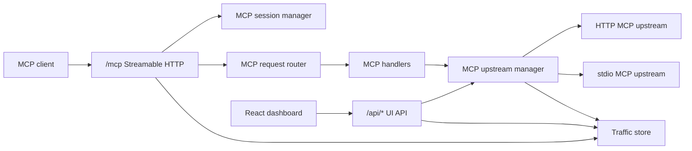

# aawa-mcpx design

## Purpose

aawa-mcpx is an MCP gateway. It exposes one public MCP Streamable HTTP endpoint
and aggregates tools, prompts, and resources from multiple configured MCP
upstreams.

The gateway provides a single client-facing MCP surface, durable backend and
tool exposure settings, and a dashboard for operational visibility.

## Main concepts

| Term | Meaning |
| ---- | ------- |
| MCP client | External client connected to aawa-mcpx through `/mcp`. |
| MCP upstream | Configured MCP server that aawa-mcpx connects to. |
| Gateway | The aawa-mcpx server process and public HTTP surface. |
| UI API | Non-MCP HTTP API under `/api/*`, used by the dashboard. |
| UI | React dashboard served by the gateway. |

## Runtime architecture



## Source layout

```text
src/
  config/         Runtime configuration loading and validation.
  gateway/        Public MCP endpoint, UI API routes, routing, and namespacing.
  mcp_upstreams/  MCP upstream connection lifecycle, catalog, and method calls.
  server/         Server-only infrastructure utilities.
  shared/         Types and helpers shared by server and UI code.
  ui/             React UI, UI components, styles, and UI-only i18n strings.
```

## Gateway layer

The gateway layer owns the public HTTP surface:

- `server.ts` starts `Bun.serve` and wires route groups.
- `mcp_http_route.ts` owns MCP HTTP method handling for `/mcp`.
- `mcp_request_router.ts` routes JSON-RPC requests by MCP method.
- `mcp_session.ts` owns session lifecycle and protocol negotiation.
- `mcp_handlers.ts` maps public MCP methods to upstream operations.
- `mcp_namespaces.ts` maps public names to and from upstream names.
- `ui_routes.ts` serves dashboard API endpoints and UI event streams.

Gateway modules depend on MCP upstream services, server utilities, and shared
contracts. They do not depend on React UI implementation modules.

## MCP upstream layer

The MCP upstream layer owns outbound MCP client behavior:

- `manager.ts` wires upstream catalog, connections, and method calls.
- `connections.ts` owns connect, reconnect, disconnect, and status lifecycle.
- `health_checks.ts` owns periodic upstream health checks.
- `catalog.ts` owns cached tools, prompts, resources, and tool exposure state.
- `method_calls.ts` calls upstream tools, prompts, and resources.
- `transport.ts` creates HTTP and stdio transports.

Health checks run only for enabled, connected backends after their catalog
refresh completes. Checks use bounded timeouts and run independently across
backends. Results invalidated by disable or reconnect events are discarded.
- `types.d.ts` defines MCP upstream manager types.

The manager exposes a stable internal API to the gateway while hiding transport,
cache, and lifecycle details.

## UI layer

The UI layer is browser-only React code:

- `main.tsx` is the browser entrypoint referenced by `src/index.html`.
- `App.tsx` owns top-level UI state and dashboard routing.
- `base_components/` contains reusable low-level UI components.
- `components/` contains reusable app-specific UI components.
- `sections/` contains page-level dashboard sections.
- `i18n/` contains UI strings.
- `styles/` contains UI CSS.

UI code depends on shared contracts and UI-local modules. It does not depend on
gateway, MCP upstream, server, or config modules.

The dashboard uses a compact footer with
`© [current year] Aawa Technologies / Mikael Nakajima`, with Aawa Technologies
linked to `https://aawa.jp`.

## Shared contracts

`shared/ui_api.ts` defines dashboard API response contracts and validators used
by the React UI.

`shared/mcp_schemas.ts` defines runtime validators for MCP shapes used at
server boundaries.

`shared/common.ts` contains small cross-runtime helpers that are safe in both
server and browser code.

## MCP protocol model

The public MCP endpoint is `/mcp`.

| Area | Status | Reason |
| ---- | ------ | ------ |
| `POST /mcp` JSON-RPC messages | Supported | Required by Streamable HTTP. Requests receive JSON-RPC responses. |
| `DELETE /mcp` session termination | Supported | Allows clients to explicitly close stateful sessions. |
| Session IDs | Supported | `mcp-session-id` is issued on successful `initialize`; later requests must use the same header. |
| Protocol negotiation | Accepted versions are pinned | Initialization accepts `2025-11-25`, `2025-06-18`, and `2025-03-26`. |
| `MCP-Protocol-Version` header | Validated when present | Unsupported versions and mismatches against the negotiated session version are rejected. |
| `GET /mcp` server-event stream | Intentionally not supported | The gateway does not send server-initiated MCP messages to clients, so the optional stream is unnecessary. |
| SSE response streams from `POST /mcp` | Intentionally not supported | Gateway operations currently complete synchronously and return one JSON-RPC response. |
| Public stdio transport | Not applicable | The gateway is HTTP-facing for clients. It can connect to stdio MCP upstreams, but it does not expose stdio to clients. |
| Origin validation | Supported when `Origin` is present | Required by Streamable HTTP security guidance to reduce DNS rebinding risk. |

JSON-RPC notifications and responses are accepted with HTTP 202 and no body
where required by the MCP Streamable HTTP rules.

The implementation keeps HTTP terminology and JSON-RPC terminology distinct.
HTTP has requests and responses. JSON-RPC has messages, and those messages can
be requests, notifications, or responses.

## Namespacing

The gateway exposes namespaced tools and prompts using:

```text
{serverName}__{originalName}
```

Resources use:

```text
{serverName}://{originalUri}
```

Namespacing prevents collisions across MCP upstreams and gives the gateway a
deterministic route back to the correct upstream.

## Persistence

`server/traffic_store.ts` stores current-run traffic records in SQLite for the
debug UI. The traffic table is reset at startup.

Backend and tool exposure state is persisted back to `mcp.json` through the
config loader so dashboard changes survive process restarts. The file is read
once at startup; runtime updates serialize the in-memory configuration and
overwrite it without rereading or merging external changes. Disabling a backend
does not change its per-tool exposure settings; configured enabled tools remain
visible as inactive until the backend is enabled again.

## Validation policy

Runtime validation for structured external data uses ArkType. This includes MCP
JSON-RPC envelopes, MCP method params handled by the gateway, HTTP API request
bodies, config files, MCP upstream responses, and overview/debug responses
consumed by the UI.

Custom validation is used only for cases that are not structured object
validation:

- HTTP header parsing, such as `Accept`, `Origin`, `mcp-session-id`, and
  `mcp-protocol-version`.
- URL query parsing, where string values are coerced into pagination/filter
  options.
- UI form parsing, where input schema metadata is inspected to build controls
  and coerce user-entered strings.
- SQLite row mapping and error normalization, where values are converted from
  storage/runtime representations into already-defined application shapes.

## Runtime boundaries

- `gateway/`, `mcp_upstreams/`, `server/`, and `config/` are server-side code.
- `ui/` is browser-side code.
- `shared/` is the only intentional cross-runtime application layer.

## Design constraints

- Bun is the runtime and HTTP server.
- MCP Streamable HTTP is the public transport.
- The gateway can connect to HTTP and stdio MCP upstreams.
- UI routes and APIs do not collide with `/mcp`.
- Structured external data is runtime validated at the documented boundaries.

## Todo

- Re-evaluate `bun test --parallel` when the test suite has enough independent
  files to benefit from worker processes.
- Benchmark `--smol` only if deployed memory usage becomes a constraint.
- Consider Bun's isolated linker and global virtual store if the repository
  becomes a workspace or repeated worktree installs become significant.
- Reassess the React Compiler after it is stable or a measurable UI rendering
  bottleneck appears.
- Consider `process.on("memoryPressure")` only if the application gains
  substantial disposable in-memory caches.
- Revisit HTTP/2 or HTTP/3 after Bun support is stable and an MCP or deployment
  requirement justifies the compatibility risk.
