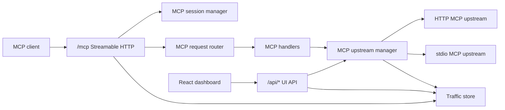

# aawa-mcpx design

## Purpose

aawa-mcpx is an MCP gateway. It exposes one public MCP Streamable HTTP endpoint
and aggregates tools, prompts, and resources from multiple configured MCP
upstreams.

The gateway provides a single client-facing MCP surface, durable backend and
tool exposure settings, and a dashboard for operational visibility.

## Main concepts

| Term | Meaning |
| ---- | ------- |
| MCP client | External client connected to aawa-mcpx through `/mcp`. |
| MCP upstream | Configured MCP server that aawa-mcpx connects to. |
| Gateway | The aawa-mcpx server process and public HTTP surface. |
| UI API | Non-MCP HTTP API under `/api/*`, used by the dashboard. |
| UI | React dashboard served by the gateway. |

## Runtime architecture



## Source layout

```text
src/
  config/         Runtime configuration loading and validation.
  gateway/        Public MCP endpoint, UI API routes, routing, and namespacing.
  mcp_upstreams/  MCP upstream connection lifecycle, catalog, and method calls.
  server/         Server-only infrastructure utilities.
  shared/         Types and helpers shared by server and UI code.
  ui/             React UI, UI components, styles, and UI-only i18n strings.
```

## Gateway layer

The gateway layer owns the public HTTP surface:

- `server.ts` starts `Bun.serve` and wires route groups.
- `mcp_http_route.ts` owns MCP HTTP method handling for `/mcp`.
- `mcp_request_router.ts` routes JSON-RPC requests by MCP method.
- `mcp_session.ts` owns session lifecycle and protocol negotiation.
- `client_activity.ts` tracks dashboard clients by reported name and version across all supported revisions. First and last activity survive protocol-session closure; the bounded in-memory history resets on gateway restart. Session IDs and connection status remain internal protocol details and are not part of the dashboard client contract.
- `mcp_handlers.ts` maps public MCP methods to upstream operations.
- `mcp_namespaces.ts` maps public names to and from upstream names.
- `ui_routes.ts` serves dashboard API endpoints and UI event streams.

Gateway modules depend on MCP upstream services, server utilities, and shared
contracts. They do not depend on React UI implementation modules.

## MCP upstream layer

The MCP upstream layer owns outbound MCP client behavior:

- `manager.ts` wires upstream catalog, connections, and method calls.
- `connections.ts` owns connect, reconnect, disconnect, and status lifecycle.
- `health_checks.ts` owns periodic upstream health checks.
- `catalog.ts` owns cached tools, prompts, resources, and tool exposure state.
- `method_calls.ts` calls upstream tools, prompts, and resources.
- `protocol_client.ts` owns backend JSON-RPC, version selection, HTTP/SSE and stdio transport behavior; SDK imports supply types only.

Health checks run only for enabled, connected backends after their catalog
refresh completes. Checks use bounded timeouts and run independently across
backends. Results invalidated by disable or reconnect events are discarded.
- `types.d.ts` defines MCP upstream manager types.

The manager exposes a stable internal API to the gateway while hiding transport,
cache, and lifecycle details.

## UI layer

The UI layer is browser-only React code:

- `main.tsx` is the browser entrypoint referenced by `src/index.html`.
- `App.tsx` owns top-level UI state and dashboard routing.
- `base_components/` contains reusable low-level UI components.
- `components/` contains reusable app-specific UI components.
- `sections/` contains page-level dashboard sections.
- `i18n/` contains UI strings.
- `styles/` contains UI CSS.

UI code depends on shared contracts and UI-local modules. It does not depend on
gateway, MCP upstream, server, or config modules.

The dashboard uses a compact footer with
`© [current year] Aawa Technologies / Mikael Nakajima`, with Aawa Technologies
linked to `https://aawa.jp`.

## Shared contracts

`shared/ui_api.ts` defines dashboard API response contracts and validators used
by the React UI.

`shared/mcp_schemas.ts` defines runtime validators for MCP shapes used at
server boundaries.

`shared/common.ts` contains small cross-runtime helpers that are safe in both
server and browser code.

## MCP protocol model

The public MCP endpoint is `/mcp`.

| Area | Status | Reason |
| ---- | ------ | ------ |
| `POST /mcp` JSON-RPC messages | Supported | Required by Streamable HTTP. Requests receive JSON-RPC responses. |
| `DELETE /mcp` session termination | Supported for 2025 revisions | Allows clients using `2025-11-25` or `2025-06-18` to close protocol sessions. |
| Session IDs | Internal to 2025 protocol handling | `mcp-session-id` is issued on successful `initialize`; subsequent requests using that session must carry it. |
| Protocol versions | Explicit supported registry | `2026-07-28` uses per-request metadata; `2025-11-25` and `2025-06-18` use initialization. |
| `MCP-Protocol-Version` header | Required for `2026-07-28` | Must match request metadata. For either supported 2025 revision, a supplied header must match the initialized session version. |
| `GET /mcp` server-event stream | Intentionally not supported | The gateway does not send server-initiated MCP messages to clients, so the optional stream is unnecessary. |
| SSE response streams from `POST /mcp` | Intentionally not supported | Gateway operations currently complete synchronously and return one JSON-RPC response. |
| Public stdio transport | Not applicable | The gateway is HTTP-facing for clients. It can connect to stdio MCP upstreams, but it does not expose stdio to clients. |
| Origin validation | Supported when `Origin` is present | Required by Streamable HTTP security guidance to reduce DNS rebinding risk. |

For `2025-11-25` and `2025-06-18`, JSON-RPC notifications and responses are accepted with HTTP 202 and no body where required. The `2026-07-28` HTTP path accepts requests without sessions, implements discovery, validates mirrored headers, and adds complete-result and cache fields. Methods removed in `2026-07-28` return HTTP 404 with JSON-RPC method-not-found. DELETE requests identifying `2026-07-28` do not terminate sessions established using either supported 2025 revision.

The ordered registry in `shared/mcp_protocol.ts` is the single supported-version source. `CURRENT_PROTOCOL_VERSION` identifies its newest entry. Initialization proposes the highest supported revision that requires initialization (`2025-11-25`). Backend selection belongs to the manager and survives connection epochs and toggles. Reconnecting with `2025-11-25` or `2025-06-18` verifies the retained selection in the new initialization response; restart is required to negotiate a different version.

Backend catalog caches for `2026-07-28` use receipt time and the minimum page TTL, scoped to one configured backend credential context. Expired catalogs refresh on access, with concurrent refresh deduplication. All pages are materialized before namespacing; upstream cursors are not exposed as aggregate cursors. Public `2026-07-28` cache hints are private with zero TTL. Unsupported interactive results fail explicitly. Structured tool content that is not an object is wrapped in a `value` field when sent using `2025-11-25` or `2025-06-18`.

Protocol contracts follow the [2026-07-28 versioning rules](https://modelcontextprotocol.io/specification/2026-07-28/basic/versioning), [HTTP binding](https://modelcontextprotocol.io/specification/2026-07-28/basic/transports/streamable-http), and [caching rules](https://modelcontextprotocol.io/specification/2026-07-28/server/utilities/caching). Parameterized local fixtures cover each supported backend version over both transports and all three external revisions through the core tool route. Public HTTP tests cover `2026-07-28` requests and sessions using `2025-11-25` and `2025-06-18`.

The implementation keeps HTTP terminology and JSON-RPC terminology distinct.
HTTP has requests and responses. JSON-RPC has messages, and those messages can
be requests, notifications, or responses.

### Session handling by protocol revision

Session state is confined to protocol transport handling. The following table
distinguishes specification requirements from gateway implementation choices.

| Concern | `2025-06-18` and `2025-11-25` | `2026-07-28` |
| ------- | --------------------------- | ------------ |
| Protocol context | Initialization establishes the selected version and client information. | Each request carries its version and client metadata; no initialization session is required. |
| HTTP session ID in the spec | A server may issue `Mcp-Session-Id` during initialization. If issued, the client must send it on subsequent HTTP requests. | Requests do not use protocol sessions or require a session ID. |
| Public gateway behavior | The gateway chooses to issue an ID and requires it for subsequent session requests. It resolves the negotiated version and client identity from its internal session map. | The gateway reads request metadata directly and does not issue or use session IDs. |
| Backend HTTP behavior | The gateway retains an ID only if the backend issues one and sends it on subsequent requests to that backend. Backends that omit the ID remain supported. | The gateway removes session headers from outgoing requests and does not retain a returned ID. |
| Backend stdio behavior | Initialization retains protocol context on the connection; there is no HTTP session header. | Per-request metadata supplies protocol context; there is no HTTP session header. |
| Session termination | The public gateway accepts session DELETE requests and removes the oldest session for a client name/version pair when a new initialization exceeds its configured limit. Missing IDs are rejected with HTTP 400; unknown or removed IDs with HTTP 404. | Session termination is not part of this request path; a DELETE identifying this revision cannot close a session belonging to a supported 2025 revision. |

The optional session-ID rules are specified in the session-management sections
of the [2025-06-18 transport specification](https://modelcontextprotocol.io/specification/2025-06-18/basic/transports#session-management)
and [2025-11-25 transport specification](https://modelcontextprotocol.io/specification/2025-11-25/basic/transports#session-management).
The request-scoped model follows the [2026-07-28 HTTP binding](https://modelcontextprotocol.io/specification/2026-07-28/basic/transports/streamable-http).
Issuing IDs on the public 2025 paths is an implementation choice permitted by
those specifications, not a requirement that every MCP server maintain sessions.
Removing that state would require replacing its version and identity lookup;
removing the header alone would break the current request validation.

Public session IDs and backend session IDs belong to separate connections and
are never forwarded between them. Backend protocol selection survives reconnects
and enable/disable changes until gateway restart, while an HTTP session ID belongs
to the individual initialized connection and is obtained again on reconnect.
Protocol negotiation failures stop automatic reconnect attempts; an explicit
disable/re-enable permits another attempt with any retained version selection.

### Client identity and observability

The dashboard groups clients by reported name and version across all supported
revisions. Session closure or limit-based removal does not remove client activity history.
This grouping assumes local use: separate clients reporting the same name and
version intentionally appear as one client. It is not an authentication identity;
remote authenticated client differentiation remains outside the current design.

Session IDs are excluded from gateway-generated logs, traffic-record identity,
and dashboard API contracts. Logs identify clients by name and version where
available. The session map contains only retained sessions, without lifecycle status, timestamps,
idle expiration, or cleanup timers. `MCP_MAX_SESSIONS_PER_CLIENT` defaults to 10.
Map insertion order determines the oldest initialization; request activity does not
change that order. The limit applies across both supported 2025 revisions for each
name/version pair, allowing multiple agents with the same reported identity. Each
successful initialization beyond the limit removes one oldest session; invalid
initialization requests remove none. Explicit DELETE removes the matching session
immediately. The client UI does not expose connected/disconnected status.

## Namespacing

The gateway exposes namespaced tools and prompts using:

```text
{serverName}__{originalName}
```

Resources use:

```text
{serverName}://{originalUri}
```

Namespacing prevents collisions across MCP upstreams and gives the gateway a
deterministic route back to the correct upstream.

## Persistence

`server/traffic_store.ts` stores current-run traffic records in SQLite for the
debug UI. The traffic table is reset at startup.

Backend and tool exposure state is persisted back to `mcp.json` through the
config loader so dashboard changes survive process restarts. The file is read
once at startup; runtime updates serialize the in-memory configuration and
overwrite it without rereading or merging external changes. Disabling a backend
does not change its per-tool exposure settings; configured enabled tools remain
visible as inactive until the backend is enabled again.

## Validation policy

Runtime validation for structured external data uses ArkType. This includes MCP
JSON-RPC envelopes, MCP method params handled by the gateway, HTTP API request
bodies, config files, MCP upstream responses, and overview/debug responses
consumed by the UI.

Custom validation is used only for cases that are not structured object
validation:

- HTTP header parsing, such as `Accept`, `Origin`, `mcp-session-id`, and
  `mcp-protocol-version`.
- URL query parsing, where string values are coerced into pagination/filter
  options.
- UI form parsing, where input schema metadata is inspected to build controls
  and coerce user-entered strings.
- SQLite row mapping and error normalization, where values are converted from
  storage/runtime representations into already-defined application shapes.

## Runtime boundaries

- `gateway/`, `mcp_upstreams/`, `server/`, and `config/` are server-side code.
- `ui/` is browser-side code.
- `shared/` is the only intentional cross-runtime application layer.

## Design constraints

- Bun is the runtime and HTTP server.
- MCP Streamable HTTP is the public transport.
- The gateway can connect to HTTP and stdio MCP upstreams.
- UI routes and APIs do not collide with `/mcp`.
- Structured external data is runtime validated at the documented boundaries.

## Todo

- Re-evaluate `bun test --parallel` when the test suite has enough independent
  files to benefit from worker processes.
- Benchmark `--smol` only if deployed memory usage becomes a constraint.
- Consider Bun's isolated linker and global virtual store if the repository
  becomes a workspace or repeated worktree installs become significant.
- Reassess the React Compiler after it is stable or a measurable UI rendering
  bottleneck appears.
- Consider `process.on("memoryPressure")` only if the application gains
  substantial disposable in-memory caches.
- Revisit HTTP/2 or HTTP/3 after Bun support is stable and an MCP or deployment
  requirement justifies the compatibility risk.
