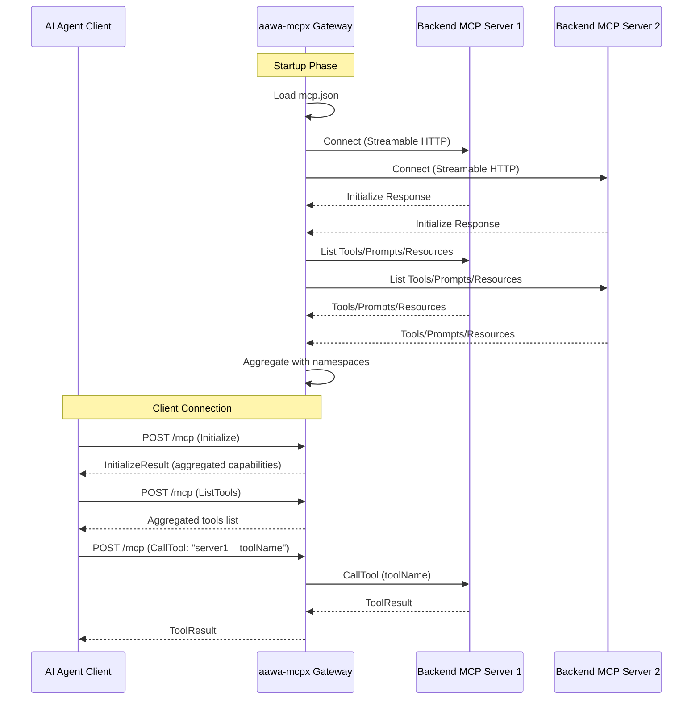
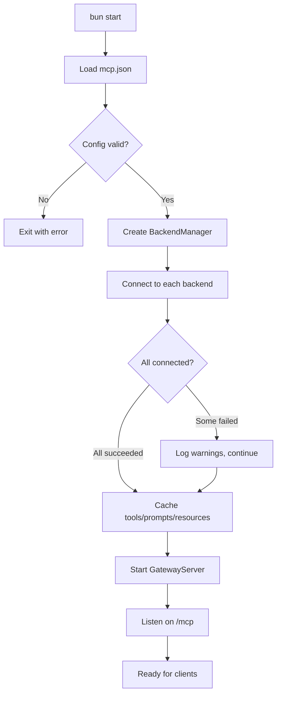

# aawa-mcpx: MCP Gateway Server Implementation Plan

## Overview

**aawa-mcpx** is a Model Context Protocol (MCP) gateway server that aggregates multiple backend MCP servers into a single unified endpoint. It acts as a proxy/aggregator, allowing AI agents to access tools, prompts, and resources from multiple MCP servers through one connection.

## Goals

1. Read backend MCP server configuration from `mcp.json`
2. Connect to configured backend MCP servers via Streamable HTTP transport
3. Expose a unified MCP server endpoint for frontend clients (also via Streamable HTTP)
4. Aggregate and namespace tools, prompts, and resources from all backends
5. Route requests to the appropriate backend server

## Non-Goals (Initial Release)

- Admin UI (existing React UI code remains for future use)
- Tests
- Build/deployment logic
- stdio or SSE transports (Streamable HTTP only - no future support planned)
- Authentication/authorization (can be added later)

---

## TypeScript Conventions

- Use `type` instead of `interface`
- Tab indentation
- No `any` types - proper typing required
- Functions use object arguments with properly defined types
- Single quote strings
- Single export statement at bottom of file (exception: React components require default export)

---

## Architecture

```
┌─────────────────────────────────────────────────────────────────────────┐
│                           aawa-mcpx Gateway                             │
│                                                                         │
│  ┌──────────────┐    ┌─────────────────────┐    ┌───────────────────┐   │
│  │ ConfigLoader │    │    GatewayServer    │    │  BackendManager   │   │
│  │              │───▶│    (MCP Server)     │◀──▶│                   │   │
│  │ - mcp.json   │    │                     │    │ - MCP Clients     │   │
│  └──────────────┘    │ - Streamable HTTP   │    │ - Connection pool │   │
│                      │ - Tool aggregation  │    │ - Health checks   │   │
│                      │ - Request routing   │    └───────────────────┘   │
│                      └──────────┬──────────┘             │              │
│                                 │                        │              │
└─────────────────────────────────┼────────────────────────┼─────────────-┘
                                  │                        │
                    ┌─────────────┴─────────────┐          │
                    │     AI Agent Clients      │          │
                    │   (Claude, Cursor, etc.)  │          │
                    │   via Streamable HTTP     │          │
                    └───────────────────────────┘          │
                                                           │
                    ┌──────────────────────────────────────┴──┐
                    │         Backend MCP Servers             │
                    │       (via Streamable HTTP)             │
                    │                                         │
                    │   ┌─────────┐  ┌─────────┐  ┌─────────┐ │
                    │   │ Server1 │  │ Server2 │  │ ServerN │ │
                    │   │ :3001   │  │ :3002   │  │ :300N   │ │
                    │   └─────────┘  └─────────┘  └─────────┘ │
                    └─────────────────────────────────────────┘
```

---

## Data Flow



---

## Configuration Format

The gateway reads configuration from `mcp.json` in the project root:

```json
{
  "mcpServers": {
    "filesystem": {
      "url": "http://localhost:3001/mcp",
      "transport": "streamable-http"
    },
    "database": {
      "url": "http://localhost:3002/mcp",
      "transport": "streamable-http",
      "headers": {
        "Authorization": "Bearer token123"
      }
    },
    "external-api": {
      "url": "https://api.example.com/mcp",
      "transport": "streamable-http"
    }
  }
}
```

### Configuration Schema

```typescript
type McpServerConfig = {
	url: string                       // MCP endpoint URL
	transport: 'streamable-http'      // Transport type (only streamable-http supported)
	headers?: Record<string, string>  // Optional HTTP headers
	timeout?: number                  // Connection timeout (ms), default 30000
	enabled?: boolean                 // Enable/disable server, default true
}

type McpConfig = {
	mcpServers: Record<string, McpServerConfig>
}
```

---

## Core Components

### 1. ConfigLoader (`src/config/loader.ts`)

Responsible for reading and validating configuration.

```typescript
type LoadConfigResult = {
	config: McpConfig
}

type ValidateConfigParams = {
	config: unknown
}

// Functions
const load = async (): Promise<LoadConfigResult> => { /* ... */ }
const validate = (params: ValidateConfigParams): McpConfig => { /* ... */ }

export { load, validate }
```

**Responsibilities:**
- Read `mcp.json` from project root
- Validate configuration schema
- Filter enabled servers
- Throw clear errors for invalid config

### 2. BackendManager (`src/backend/manager.ts`)

Manages connections to all backend MCP servers.

```typescript
import type { Client } from '@modelcontextprotocol/sdk/client'
import type { Tool, Prompt, Resource } from '@modelcontextprotocol/sdk/types'

type CreateBackendManagerParams = {
	config: McpConfig
}

type GetClientParams = {
	serverName: string
}

type CallToolParams = {
	serverName: string
	toolName: string
	args: Record<string, unknown>
}

type GetPromptParams = {
	serverName: string
	promptName: string
	args: Record<string, unknown>
}

type ReadResourceParams = {
	serverName: string
	uri: string
}

type ToolsMap = Map<string, Tool[]>
type PromptsMap = Map<string, Prompt[]>
type ResourcesMap = Map<string, Resource[]>
type ClientsMap = Map<string, Client>

type BackendManager = {
	initialize: () => Promise<void>
	getClient: (params: GetClientParams) => Client | undefined
	getAllClients: () => ClientsMap
	disconnect: () => Promise<void>
	listAllTools: () => Promise<ToolsMap>
	listAllPrompts: () => Promise<PromptsMap>
	listAllResources: () => Promise<ResourcesMap>
	callTool: (params: CallToolParams) => Promise<CallToolResult>
	getPrompt: (params: GetPromptParams) => Promise<GetPromptResult>
	readResource: (params: ReadResourceParams) => Promise<ReadResourceResult>
}
```

**Responsibilities:**
- Create MCP Client for each configured backend
- Connect to backends using Streamable HTTP transport
- Handle connection errors and reconnection
- Cache tool/prompt/resource lists
- Route calls to appropriate backend

### 3. GatewayServer (`src/gateway/server.ts`)

The main MCP server that clients connect to.

```typescript
type StartServerParams = {
	port: number
	backendManager: BackendManager
}

type ServerInstance = {
	stop: () => Promise<void>
}

const startServer = async (params: StartServerParams): Promise<ServerInstance> => { /* ... */ }

export { startServer }
```

**Responsibilities:**
- Expose Streamable HTTP MCP endpoint at `/mcp`
- Handle MCP protocol lifecycle (initialize, shutdown)
- Aggregate tools/prompts/resources with namespace prefixes
- Route tool calls to appropriate backend
- Manage client sessions

### 4. NamespaceManager (`src/gateway/namespace.ts`)

Handles namespacing to prevent tool/prompt/resource name collisions.

```typescript
import type { Tool, Prompt, Resource } from '@modelcontextprotocol/sdk/types'

type AddPrefixParams = {
	serverName: string
	name: string
}

type ParsePrefixResult = {
	serverName: string
	originalName: string
}

type NamespaceToolParams = {
	serverName: string
	tool: Tool
}

type NamespacePromptParams = {
	serverName: string
	prompt: Prompt
}

type NamespaceResourceParams = {
	serverName: string
	resource: Resource
}

const addPrefix = (params: AddPrefixParams): string => { /* ... */ }
const parsePrefix = (prefixedName: string): ParsePrefixResult => { /* ... */ }
const namespaceTool = (params: NamespaceToolParams): Tool => { /* ... */ }
const namespacePrompt = (params: NamespacePromptParams): Prompt => { /* ... */ }
const namespaceResource = (params: NamespaceResourceParams): Resource => { /* ... */ }

export { addPrefix, parsePrefix, namespaceTool, namespacePrompt, namespaceResource }
```

**Naming Convention:**
- Tools: `serverName__toolName` (double underscore separator)
- Prompts: `serverName__promptName`
- Resources: `serverName://original/uri` (prefix scheme)

---

## Directory Structure

```
aawa-mcpx/
├── src/
│   ├── index.ts              # Entry point - starts the gateway
│   ├── config/
│   │   ├── loader.ts         # Configuration loading
│   │   └── types.ts          # Configuration types
│   ├── backend/
│   │   ├── manager.ts        # Backend connection manager
│   │   ├── client.ts         # MCP client wrapper
│   │   └── types.ts          # Backend types
│   ├── gateway/
│   │   ├── server.ts         # Gateway MCP server
│   │   ├── handlers.ts       # MCP request handlers
│   │   ├── namespace.ts      # Namespace management
│   │   └── types.ts          # Gateway types
│   ├── utils/
│   │   └── logger.ts         # Simple logging utility
│   ├── components/           # (Existing React UI - preserved for future)
│   ├── lib/                  # (Existing utilities)
│   ├── App.tsx               # (Existing - preserved for future)
│   ├── frontend.tsx          # (Existing - preserved for future)
│   ├── index.html            # (Existing - preserved for future)
│   └── index.css             # (Existing - preserved for future)
├── mcp.json                  # Backend server configuration
├── package.json
├── tsconfig.json
└── CLAUDE.md
```

---

## Dependencies

Add to `package.json`:

```json
{
  "dependencies": {
    "@modelcontextprotocol/sdk": "^1.24.0"
  }
}
```

The `@modelcontextprotocol/sdk` provides:
- `McpServer` - Base server class
- `Client` - MCP client for connecting to backends
- `StreamableHTTPServerTransport` - Server-side Streamable HTTP transport
- `StreamableHTTPClientTransport` - Client-side Streamable HTTP transport
- Type definitions for all MCP messages

---

## Implementation Details

### Entry Point (`src/index.ts`)

```typescript
import { load as loadConfig } from '@/config/loader'
import { createBackendManager } from '@/backend/manager'
import { startServer } from '@/gateway/server'

const main = async (): Promise<void> => {
	// 1. Load configuration
	const { config } = await loadConfig()
	
	// 2. Initialize backend manager
	const backendManager = createBackendManager({ config })
	await backendManager.initialize()
	
	// 3. Start gateway server
	const server = await startServer({ port: 3000, backendManager })
	
	console.log('🚀 aawa-mcpx gateway running on http://localhost:3000/mcp')
	
	// 4. Handle shutdown
	process.on('SIGINT', async () => {
		await server.stop()
		await backendManager.disconnect()
		process.exit(0)
	})
}

main().catch(console.error)
```

### Streamable HTTP Server Implementation

Using Bun.serve():

```typescript
type McpRequestBody = {
	jsonrpc: '2.0'
	id?: string | number
	method: string
	params?: Record<string, unknown>
}

type HandleRequestParams = {
	body: McpRequestBody
	sessionId: string | null
}

const startServer = async (params: StartServerParams): Promise<ServerInstance> => {
	const { port, backendManager } = params
	
	const server = Bun.serve({
		port,
		routes: {
			'/mcp': {
				async POST(req) {
					const body = await req.json() as McpRequestBody
					const accept = req.headers.get('Accept') ?? ''
					const sessionId = req.headers.get('Mcp-Session-Id')
					
					// Handle JSON-RPC message
					const response = await handleRequest({ body, sessionId })
					
					if (response.streaming && accept.includes('text/event-stream')) {
						// Return SSE stream for streaming responses
						return new Response(response.stream, {
							headers: { 'Content-Type': 'text/event-stream' }
						})
					}
					
					// Return JSON response
					return Response.json(response.result, {
						headers: response.sessionId
							? { 'Mcp-Session-Id': response.sessionId }
							: {}
					})
				},
				
				GET(req) {
					const accept = req.headers.get('Accept') ?? ''
					if (!accept.includes('text/event-stream')) {
						return new Response('Method Not Allowed', { status: 405 })
					}
					
					// SSE stream for server-initiated messages
					return new Response(createNotificationStream(), {
						headers: { 'Content-Type': 'text/event-stream' }
					})
				}
			},
			
			'/mcp/:sessionId': {
				async DELETE(req) {
					const sessionId = req.params.sessionId
					await terminateSession({ sessionId })
					return new Response(null, { status: 202 })
				}
			}
		},
		
		// Fallback for unmatched routes
		fetch(req) {
			return new Response('Not Found', { status: 404 })
		},
		
		error(error) {
			console.error('Server error:', error)
			return new Response('Internal Server Error', { status: 500 })
		}
	})
	
	return {
		stop: async () => {
			await server.stop()
		}
	}
}
```

### Tool Aggregation Example

```typescript
import type { Tool, ListToolsResult } from '@modelcontextprotocol/sdk/types'

type AggregateToolsParams = {
	backendManager: BackendManager
}

const aggregateTools = async (params: AggregateToolsParams): Promise<ListToolsResult> => {
	const { backendManager } = params
	const allTools: Tool[] = []
	
	for (const [serverName, client] of backendManager.getAllClients()) {
		const result = await client.listTools()
		
		for (const tool of result.tools) {
			allTools.push({
				name: `${serverName}__${tool.name}`,
				description: `[${serverName}] ${tool.description}`,
				inputSchema: tool.inputSchema
			})
		}
	}
	
	return { tools: allTools }
}
```

### Tool Call Routing Example

```typescript
import type { CallToolRequest, CallToolResult } from '@modelcontextprotocol/sdk/types'

type RouteToolCallParams = {
	request: CallToolRequest
	backendManager: BackendManager
}

const routeToolCall = async (params: RouteToolCallParams): Promise<CallToolResult> => {
	const { request, backendManager } = params
	const { serverName, originalName } = parsePrefix(request.params.name)
	
	const client = backendManager.getClient({ serverName })
	if (!client) {
		return {
			isError: true,
			content: [{ type: 'text', text: `Unknown server: ${serverName}` }]
		}
	}
	
	return await client.callTool({
		name: originalName,
		arguments: request.params.arguments
	})
}
```

---

## MCP Protocol Compliance

The gateway must implement these MCP server capabilities:

### Required Handlers

| Method | Description |
|--------|-------------|
| `initialize` | Return aggregated server capabilities |
| `tools/list` | Return namespaced tools from all backends |
| `tools/call` | Route to appropriate backend |
| `prompts/list` | Return namespaced prompts from all backends |
| `prompts/get` | Route to appropriate backend |
| `resources/list` | Return namespaced resources from all backends |
| `resources/read` | Route to appropriate backend |

### Session Management

- Generate unique session ID on initialize
- Include `Mcp-Session-Id` header in responses
- Validate session ID on subsequent requests
- Support session termination via DELETE

### Protocol Version

- Support `MCP-Protocol-Version: 2025-06-18` header
- Include version in initialization response

---

## Error Handling

### Backend Connection Errors

```typescript
type ConnectToBackendParams = {
	serverName: string
	config: McpServerConfig
}

const connectToBackend = async (params: ConnectToBackendParams): Promise<void> => {
	const { serverName, config } = params
	
	try {
		await client.connect()
	} catch (error) {
		console.error(`Failed to connect to ${serverName}: ${(error as Error).message}`)
		// Mark server as unavailable, don't fail entire gateway
	}
}
```

### Tool Call Errors

```typescript
type HandleToolErrorParams = {
	serverName: string
	error: unknown
}

const createToolError = (params: HandleToolErrorParams): CallToolResult => {
	const { serverName, error } = params
	
	return {
		isError: true,
		content: [{ type: 'text', text: `Server "${serverName}" error: ${(error as Error).message}` }]
	}
}
```

---

## Startup Sequence



---

## Future Enhancements (Not in Initial Scope)

1. **Admin UI** - Web interface to manage backends
2. **Authentication** - API keys, OAuth support
3. **Rate Limiting** - Per-client rate limits
4. **Caching** - Cache backend responses
5. **Health Checks** - Periodic backend health monitoring
6. **Metrics** - Request/error counts, latency tracking
7. **Hot Reload** - Reload config without restart
8. **Load Balancing** - Multiple instances of same backend

---

## Implementation Order

1. **Phase 1: Core Infrastructure**
   - [ ] Create directory structure
   - [ ] Set up TypeScript configuration
   - [ ] Add @modelcontextprotocol/sdk dependency
   - [ ] Implement ConfigLoader

2. **Phase 2: Backend Connections**
   - [ ] Implement BackendManager
   - [ ] Implement MCP Client wrapper
   - [ ] Test connection to single backend

3. **Phase 3: Gateway Server**
   - [ ] Implement GatewayServer with Bun.serve()
   - [ ] Implement Streamable HTTP transport handling
   - [ ] Implement session management

4. **Phase 4: Aggregation & Routing**
   - [ ] Implement NamespaceManager
   - [ ] Implement tool/prompt/resource aggregation
   - [ ] Implement request routing

5. **Phase 5: Integration**
   - [ ] End-to-end testing with real backends
   - [ ] Error handling refinement
   - [ ] Documentation

---

## Example Usage

### 1. Create Configuration

```json
// mcp.json
{
  "mcpServers": {
    "filesystem": {
      "url": "http://localhost:3001/mcp",
      "transport": "streamable-http"
    }
  }
}
```

### 2. Start Gateway

```bash
bun start
# Output: 🚀 aawa-mcpx gateway running on http://localhost:3000/mcp
```

### 3. Connect Client

Configure your MCP client (Claude Desktop, Cursor, etc.):

```json
{
  "mcpServers": {
    "aawa-gateway": {
      "url": "http://localhost:3000/mcp",
      "transport": "streamable-http"
    }
  }
}
```

### 4. Use Aggregated Tools

The client will see tools like:
- `filesystem__read_file`
- `filesystem__write_file`
- `filesystem__list_directory`

---

## References

- [MCP Specification - Transports](https://modelcontextprotocol.io/specification/2025-06-18/basic/transports)
- [MCP TypeScript SDK](https://github.com/modelcontextprotocol/typescript-sdk)
- [MetaMCP (Reference Implementation)](https://github.com/metatool-ai/mcp-server-metamcp)
- [Lunar MCPX](https://github.com/TheLunarCompany/lunar/tree/main/mcpx)
